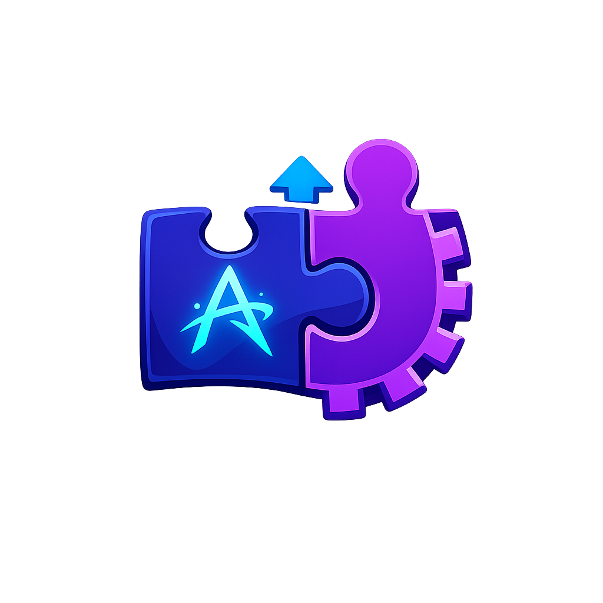

<div align="center">
  
  
  # Qddons Manager
  
  **Один менеджер аддонов для всего зоопарка WoW.** 🐺

  [](https://flutter.dev)
  [](https://dart.dev)
  <br>
  [](#)
  [](#)
  [](#)
  
  <br>
  
  [](README.md)
  
  <br>
  
  <a href="https://boosty.to/"> <!-- Впиши сюда ссылку на свой Boosty! / Put your Boosty link here! -->
    
  </a>
</div>

---

## 🎯 Что Это

**Qddons Manager** — это десктопное приложение на Flutter для управления аддонами World of Warcraft на **Windows, Linux и macOS**.

Главная идея простая:
- 🔍 **Определять** и работать с разными версиями клиента WoW.
- 🕰️ **Поддерживать** старые, пиратские, classic и retail-ветки.
- 📦 **Искать** аддоны по нескольким источникам.
- 📥 **Устанавливать** их прямо в нужную папку `Interface/AddOns`.
- 🗂️ **Управлять** локально установленными аддонами из одного места.

Коротко: **один менеджер для любого клиента, а не только для одной "правильной" версии.**

---

## 🌍 Зачем Он Нужен

Большинство менеджеров аддонов чувствуют себя хорошо только в стерильной вселенной: один лаунчер, одна поддерживаемая ветка, одна экосистема и каталог, который якобы хранит вообще всё.

У игроков WoW реальность обычно куда веселее. Qddons Manager рассчитан как раз на ситуацию, где рядом живут:
- `3.3.5`
- `5.4.8`
- `7.3.5`
- Retail
- **и всем им нужны аддоны. Желательно без шаманства.**

---

## ✨ Основные Плюсы

- 🎭 **Работа с любым семейством WoW-клиентов**
  Приложение определяет версию/эпоху клиента и подстраивает поиск, матчинг, установку и локальную обработку аддонов под конкретную ветку.

- 🌐 **Мульти-источниковый поиск**
  Архитектура не завязана на один каталог и не делает вид, будто один источник хранит все версии всех аддонов за всю историю WoW.

- ✅ **Проверяемая установка**
  Поиск и установка ориентированы на реальные installable-результаты, а не на шумные ложные совпадения.

- 🖼️ **Попап с подробностями аддона**
  Карточка поиска может открывать название, картинку, описание, галерею, источник и версию.

- 📂 **Управление локальными аддонами**
  Можно видеть установленные аддоны, их группы и отличать managed-установки от вручную добавленного контента.

- 🚀 **Запуск игры прямо из интерфейса**
  Если исполняемый файл клиента известен, игру можно запускать прямо с экрана клиента.

- 🎨 **Визуал, завязанный на эпоху клиента**
  Баннеры, иконки, карточки и шапки клиентов различаются по дополнениям и не выглядят как одна и та же безликая таблица.

- 💫 **Нормальный desktop UX**
  Более плавная прокрутка, аккуратные карточки, улучшенные детали и в целом более взрослое взаимодействие.

---

## 🔌 Источники

Приложение строится как мульти-источниковая система. В зависимости от доступности и правил верификации кодовая база уже умеет работать с интеграциями вроде:
- **CurseForge**
- **GitHub**
- **Wowskill**

Качество покрытия по эпохам у источников разное. Именно поэтому упор сделан на *гибкость по источникам*, а не на наивную веру в то, что один каталог помнит каждый аддон с каждой версии WoW навсегда.

---

## 💻 Технологии

- **Flutter / Dart**
- **Material 3 Expressive**
- Платформы:
  - Windows
  - Linux
  - macOS

---

## 📈 Статус Проекта

Проект подходит к своей **первой пилотной версии**.

Базовые сценарии уже закрыты: определение клиентов, поиск аддонов, verified install, отображение локальных аддонов, работа с разными эпохами клиента и серьёзно улучшенный desktop UI.

Ещё есть, что допиливать (бóльшую уникальность иконок эпох, дальнейшее расширение источников, дополнительную UI-полировку, релизный контур), но главное уже есть:
**оно работает, и работает даже с теми клиентами, на которые обычно все забивают.**

---

## 🚀 Быстрый Старт

Убедитесь, что у вас установлен Flutter, и выполните:

```bash
flutter pub get

# Запуск на вашей десктопной платформе
flutter run -d windows
# Или:
# flutter run -d linux
# flutter run -d macos
```

---

## 🤝 Репозиторий и Ссылки

- **GitHub:** [QurieGLord/WoW-QAddOns-Manager](https://github.com/QurieGLord/WoW-QAddOns-Manager)

> **Финальная Ремарка:** Если твоя коллекция WoW-клиентов больше похожа на музей, полевой архив и техноколдовской ритуал одновременно — значит, Qddons Manager делался не зря.
